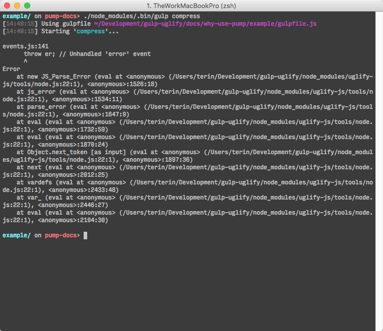

# なぜ Pump を使用する？

Node.js ストリームから `pipe` を使用するとき、エラーはパイプストリームを通して前方に伝播されず、出力先ストリームが閉じてもソースストリームは閉じられません。[`pump`][pump] モジュールはこれらの問題を正規化し、コールバックでエラーを渡します。

## 一般的な gulpfile の例

gulpfile の一般的なパターンは、単に Node.js ストリームを返し、gulp ツールがエラーをハンドルすることを期待することです。

```javascript
// example of a common gulpfile
var gulp = require('gulp');
var uglify = require('gulp-uglify');

gulp.task('compress', function () {
  // returns a Node.js stream, but no handling of error messages
  return gulp.src('lib/*.js')
    .pipe(uglify())
    .pipe(gulp.dest('dist'));
});
```



JavaScript ファイルの1つにエラーがありますが、そのエラーメッセージは役に立ちません。どのファイルのどの行にエラーが起こっているのか知りたいのに、この混乱は何でしょうか？

ストリームにエラーが起こると、Node.js ストリームは 'error' イベントを発火しますが、このイベントに対するハンドラーがない場合、代わりに定義済みの [uncaught exception][uncaughtException] ハンドラーに移動します。uncaught exception ハンドラーのデフォルトの振る舞いはドキュメント化されています。

> デフォルトで、Node.js はスタックトレースを stderr に出力して終了することによって、そのような例外をハンドルします。

## エラーのハンドリング

エラーが uncaught exception ハンドラーに到達することを許可することは役に立たないので、例外を適切にハンドルすべきです。簡単に見てみましょう。

```javascript
var gulp = require('gulp');
var uglify = require('gulp-uglify');

gulp.task('compress', function () {
  return gulp.src('lib/*.js')
    .pipe(uglify())
    .pipe(gulp.dest('dist'))
    .on('error', function(err) {
      console.error('Error in compress task', err.toString());
    });
});
```

残念ながら、Node.js ストリームの `pipe` 関数はチェーンを通じてエラーを転送しないので、このエラーハンドラーは `gulp.dest` によって与えられたエラーのみをハンドルします。代わりに、各ストリームのエラーをハンドルする必要があります。

```javascript
var gulp = require('gulp');
var uglify = require('gulp-uglify');

gulp.task('compress', function () {
  function createErrorHandler(name) {
    return function (err) {
      console.error('Error from ' + name + ' in compress task', err.toString());
    };
  }

  return gulp.src('lib/*.js')
    .on('error', createErrorHandler('gulp.src'))
    .pipe(uglify())
    .on('error', createErrorHandler('uglify'))
    .pipe(gulp.dest('dist'))
    .on('error', createErrorHandler('gulp.dest'));
});
```

gulp タスクのそれぞれに追加するのは非常に困難で、忘れることは容易です。さらに、タスクが失敗したことを gulp のタスクシステムに適切に通知しないため、これは完璧ではありません。これは修正できます。また、ストリームを用いたエラーの伝播に関する他の厄介な問題を処置できますが、さらなる作業が必要です！

## pump の使用

[`pump`][pump] モジュールはチートコードのようなものです。これらの場合を処理する `pipe` 機能のラッパーであるため、gulpfile のハッキングをやめ、アプリへ新しい機能をハッキングすることに戻ることができます。

```javascript
var gulp = require('gulp');
var uglify = require('gulp-uglify');
var pump = require('pump');

gulp.task('compress', function (cb) {
  pump([
      gulp.src('lib/*.js'),
      uglify(),
      gulp.dest('dist')
    ],
    cb
  );
});
```

gulp タスクシステムはコールバックを備えた gulp タスクを提供します。コールバックは、タスクの正常終了（引数なしで呼ばれる）またはタスクの失敗（エラー引数で呼ばれる）を通知できます。幸いなことに、これは `pump` が使用する形式とまったく同じです！


これで、どのプラグインでエラーが起こったか、どのようなエラーか、どのファイルと行数からエラーが起こったかが非常に明瞭になります。

[pump]: https://github.com/mafintosh/pump
[uncaughtException]: https://nodejs.org/api/process.html#process_event_uncaughtexception
